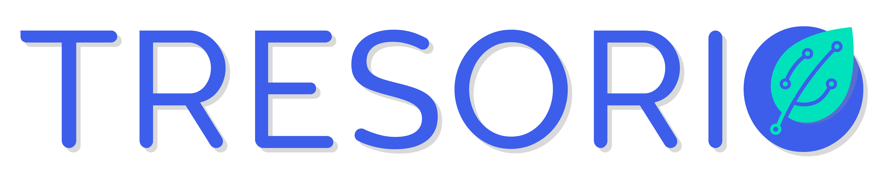

A small project that use Tresorio cloud computing to generate a dataset of BTCUSD charts and train an AI to look into the charts and predict stock movements.

This project is inspired by this one : https://github.com/cderinbogaz/inpredo.

## First Step - Create an account on Tresorio

Tresorio, the eco-friendly and affordable alternative for all your tasks and projects that require a lot of computing power! Each task started on Tresorio contribute to generate hot water to heat community buildings !

Create an account on : https://tresorio.com/en/beta/

## Second Step - Clone this repo:

Clone this repo on your personal github to be able to launch the project on Tresorio.

## Third Step - Create a project on your Tresorio account 

## Fourth Step - Generate your charts dataset

Before start to train a Convolutional Neural Network, first you need to create a
training dataset. As a starting point you can use one of the following timeseries financial data:

- BTC-USD Hourly price data on Poloniex; poloniexclean.csv
- BTC-USD Hourly price data on Kraken; krakenclean.csv
- BTC-USD Hourly price data on Binance; binanceclean.csv
- BTC-USD Hourly price data on Bitfinex; bitfinexclean.csv
- BTC-USD Hourly price data on Bitstamp; bitstampclean.csv
- BTC-USD Hourly price data on Coinbase; coinbaseclean.csv

Datas are from https://www.cryptodatadownload.com/

This code line is found under `graphwerk.py` which is the factory that produces images out of time series financial data.
After running `graphwerk.py` it will take some time to write single jpg files under data/train folder.
When script is done writing, then you need to take randomly roughly 20 percent of the training data and put it into validation data.
You need this to be able to train a neural network and yes, I was too lazy to automate that as well.

## Fifth step - Train the AI!

Now we have the training and validation datasets in place, you can start training the AI model.
For this you just need to run `train-binary.py` and this script will start using the dataset make a AI model out of it.
When the model training is complete, it will generate a model and weights file under the models directory.

## Sixth Step - Load Models and Predict

You can run predictions using `predict-binary.py` script. Use the `predict(file)`
and use the path of the jpg file you want to predict. Result of the script will be a buy, sell or not confident message.

## Last words

THIS PROJECT IS FOR EDUCATIONAL PURPOSE ONLY ! DON'T USE IT TO MAKE REAL INVESTMENTS !

For people who wants to go experimental, don't forget that you can lose money in real markets and I am not accountable for your loss if you choose to use this project to trade with your own money.

Medium article for in depth explanation of the project: https://medium.com/@cderinbogaz/making-a-i-that-looks-into-trade-charts-62e7d51edcba